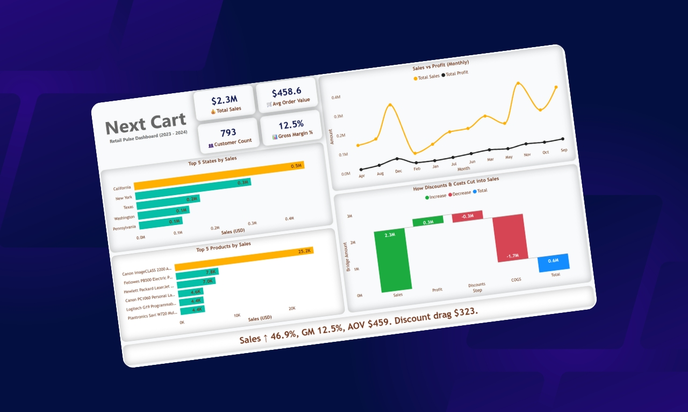
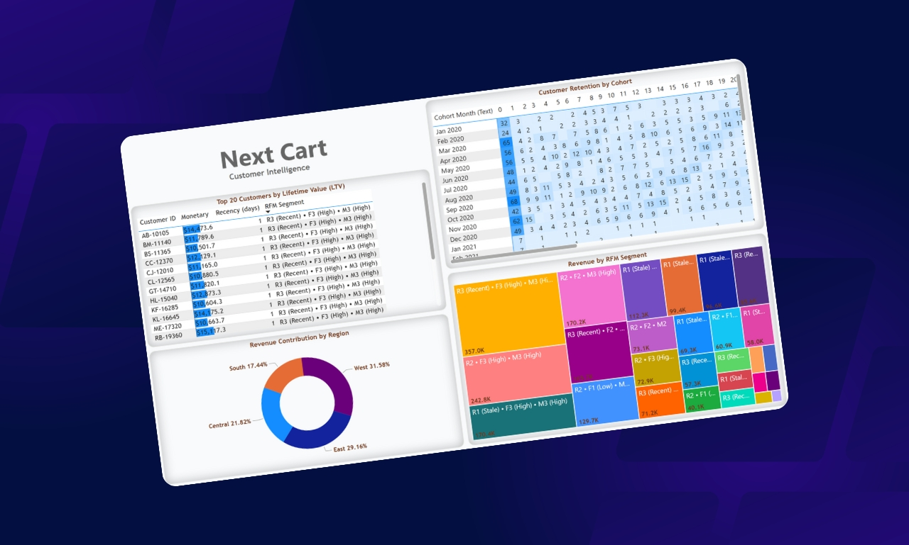

# NextCart — Retail & Customer Intelligence Dashboard  

A two-page **Power BI portfolio project** showcasing executive financial performance and advanced customer analytics for a retail store. Designed with a **modern storytelling layout, clear KPIs, and CFO-ready visuals**.  

---

## Project Overview  

Retail businesses need two answers:  

1. **How is the business performing overall?**  
2. **Who are the customers driving (or dragging) performance?**  

This project answers both in **two pages**:  

- **Page 1: Retail Pulse Dashboard** → Executive performance, revenue drivers, discount leakage.  
- **Page 2: Customer Intelligence** → RFM segmentation, cohorts, and top customer insights.  

---

## Dashboard Pages  

### 🔹 Page 1 — Retail Pulse (Executive Overview)  

  

**Key Features:**  
- 💰 **KPI Row** → Total Sales, Avg Order Value, Customer Count, Gross Margin %.  
- 📈 **Sales vs Profit Trend** → See if profits track sales or lag behind.  
- 🗺️ **Top States & Products** → Where sales happen, which items drive growth.  
- 🧮 **Waterfall (Sales → Discounts → Costs → Profit)** → CFO-style margin story.  
- 📝 **Smart Narrative** → “Sales ↑ 46.9%, GM 12.5%, AOV $459, discount drag $323.”  

👉 **Purpose**: At a glance, leaders understand *performance, drivers, and leakages*.  

---

### 🔹 Page 2 — Customer Intelligence (RFM & Cohorts)  

  

**Key Features:**  
- 👑 **Top 20 Customers (LTV)** → High-value customers driving ~11.5% of revenue.  
- 🔄 **Cohort Matrix** → Retention patterns — do new customers come back?  
- 🌍 **Revenue by Region** → Which regions dominate, which need focus.  
- 🧩 **RFM Treemap** → Customers bucketed by Recency, Frequency, and Monetary value.  

👉 **Purpose**: Answers *which customers matter most, who’s slipping, and where to double down*.  

---

## Business Storytelling  

- Page 1: *“Performance at a glance — growth is strong, but discounts eat into profit.”*  
- Page 2: *“Customers matter — top 20 drive 11.5% revenue, RFM shows high churn risk in stale segments.”*  

---

## Tech & Methods  

- **Tool** → Microsoft Power BI  
- **Data Prep** → Power Query (cleaning, joins, date table)  
- **Modeling** → DAX Measures for Sales, Profit, RFM Buckets, Cohorts  
- **Visuals** → KPI Cards, Line Charts, Waterfall, Treemap, Donut, Matrix  

---

## Why This Project Matters  

✔️ Shows both **finance & customer analytics** (a rare combo).  
✔️ Demonstrates **advanced DAX (RFM, cohorts)** beyond basic KPIs.  
✔️ Storytelling focus → not just charts, but *business impact*.  

---

## 🔑 Key Takeaway  

This dashboard answers:  
- *“How is the business performing?”*  
- *“Who are the customers driving it?”*   

---

✨ **NextCart — Retail Pulse & Customer Intelligence**