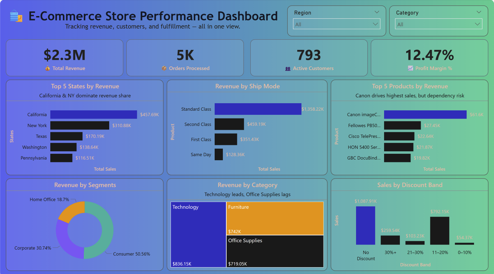

# E-Commerce Performance Dashboard

> A comprehensive Power BI dashboard delivering actionable insights for e-commerce business intelligence

## Overview

This project presents a modern, executive-ready Power BI dashboard that transforms raw e-commerce data into strategic business insights. Designed with a focus on user experience and data storytelling, it provides a complete view of business performance in a single, interactive interface.

## Business Impact

The dashboard addresses critical business questions that drive strategic decisions:

- **Revenue Performance**: Track $2.3M in total revenue with 12.47% profit margin
- **Geographic Insights**: Identify California and New York as revenue powerhouses  
- **Product Strategy**: Highlight top-performing products and category profitability
- **Customer Segmentation**: Analyze revenue distribution across consumer segments
- **Operational Efficiency**: Optimize shipping modes and discount strategies

## Key Features

### Executive KPIs
- **Total Revenue**: $2.3M
- **Orders Processed**: 5,000+
- **Active Customers**: 793
- **Profit Margin**: 12.47%

### Interactive Visualizations
- **Geographic Analysis**: Top-performing states with revenue breakdown
- **Product Performance**: Revenue ranking with dependency risk assessment
- **Shipping Intelligence**: Mode distribution and delivery insights
- **Customer Segmentation**: Revenue split by business segments
- **Discount Impact**: Profit analysis across discount bands

### Technologies Used
- **Power BI Desktop**: Dashboard development and visualization
- **DAX**: Advanced calculations and KPI measures
- **Data Modeling**: Relationship optimization and performance tuning

### Key DAX Measures
- Profit Margin % calculation
- Active customer count
- Revenue trend analysis
- Discount impact assessment

## Design Philosophy

This dashboard prioritizes:
- **Executive Focus**: Single-page layout for quick decision-making
- **Modern UI/UX**: App-style interface with gradient backgrounds and intuitive navigation
- **Data Storytelling**: Each visual includes contextual insights and recommendations
- **Responsive Design**: Optimized for desktop and tablet viewing

## Business Insights

### Revenue Drivers
1. **Geographic Concentration**: CA and NY represent 35% of total revenue
2. **Product Dependency**: Canon products drive highest sales volume
3. **Shipping Preferences**: 60% of customers prefer Standard Class shipping

## Skills Demonstrated

- **Data Visualization**: Creating compelling, business-focused dashboards
- **Business Intelligence**: Translating data into actionable insights
- **User Experience Design**: Intuitive interface design for executive users
- **Data Modeling**: Efficient relationships and performance optimization
- **Strategic Thinking**: Business-relevant KPI selection and insight generation

---

*This project showcases advanced Power BI capabilities and business intelligence expertise. Available for similar dashboard development projects.*
