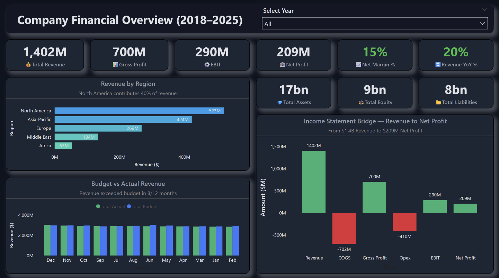

# 📊 Company Financial Overview Dashboard

A comprehensive Power BI dashboard providing real-time financial insights and performance metrics for strategic decision-making across multiple business dimensions.

## 🎯 Project Overview

This interactive financial dashboard transforms complex financial data into actionable insights, enabling executives and stakeholders to monitor company performance across revenue, profitability, and operational metrics from 2018-2025.

### Key Features

- **Real-time Financial Metrics**: Track revenue, profit margins, and growth indicators
- **Regional Performance Analysis**: Revenue breakdown across North America, Asia-Pacific, Europe, Middle East, and Africa
- **Budget vs Actual Tracking**: Monthly comparison with performance indicators
- **Interactive Waterfall Analysis**: Visual journey from revenue to net profit
- **Dynamic Year Filtering**: Flexible time-period analysis

## 📈 Dashboard Components

### Primary KPIs
- **Total Revenue**: $1.4B with 20% YoY growth
- **Gross Profit**: $700M maintaining healthy margins
- **EBIT**: $290M operational efficiency indicator
- **Net Profit**: $209M with 15% net margin
- **Financial Position**: $17B assets, $9B equity, $8B liabilities

### Visual Analytics

1. **Revenue by Region Chart**
  - Horizontal bar chart showing geographic performance
  - North America leading at 40% revenue contribution ($523M)
  - Clear visualization of market penetration across regions

2. **Budget vs Actual Performance**
  - Monthly trend analysis over 12-month period
  - Performance indicator: Revenue exceeded budget in 8/12 months
  - Color-coded visualization for quick variance identification

3. **Income Statement Bridge**
  - Waterfall chart mapping revenue flow to net profit
  - Visual breakdown: Revenue → COGS → Gross Profit → OpEx → EBIT → Net Profit
  - Transparent view of cost structure and profitability drivers

## 🛠️ Technical Implementation

### Power BI Features Utilized
- **DAX Calculations**: Complex financial metrics and ratios
- **Interactive Filters**: Dynamic year selection and drill-down capabilities
- **Custom Visualizations**: Waterfall charts and KPI cards
- **Responsive Design**: Optimized for various screen sizes
- **Color Psychology**: Green for positive metrics, red for costs/negative variances

### Insights Delivered
- **Performance Monitoring**: Real-time tracking of financial health
- **Regional Strategy**: Data-driven geographic expansion decisions
- **Budget Management**: Proactive variance identification and management
- **Profitability Analysis**: Clear understanding of margin drivers

## 🏆 Skills Demonstrated

- **Business Intelligence**: Advanced Power BI development and design
- **Financial Analysis**: Deep understanding of financial metrics and KPIs
- **Data Visualization**: Effective use of charts, colors, and layout principles
- **DAX Programming**: Complex calculations and measure development
- **UX/UI Design**: Intuitive dashboard layout and user experience
- **Stakeholder Communication**: Clear presentation of complex financial data

⭐ **If you found this dashboard helpful, please consider giving it a star!**