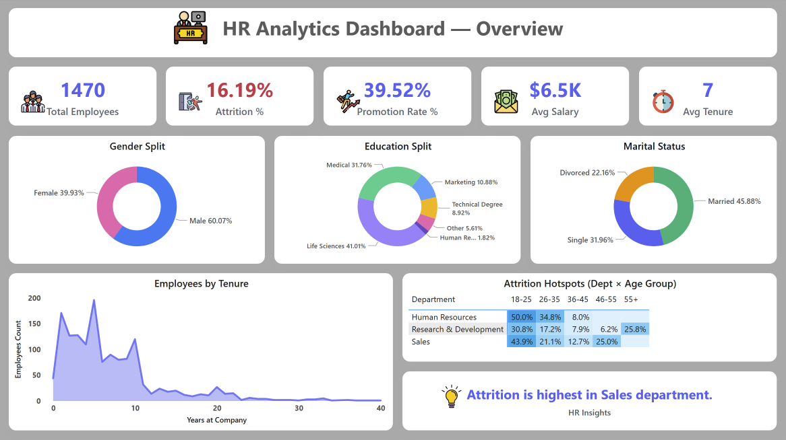
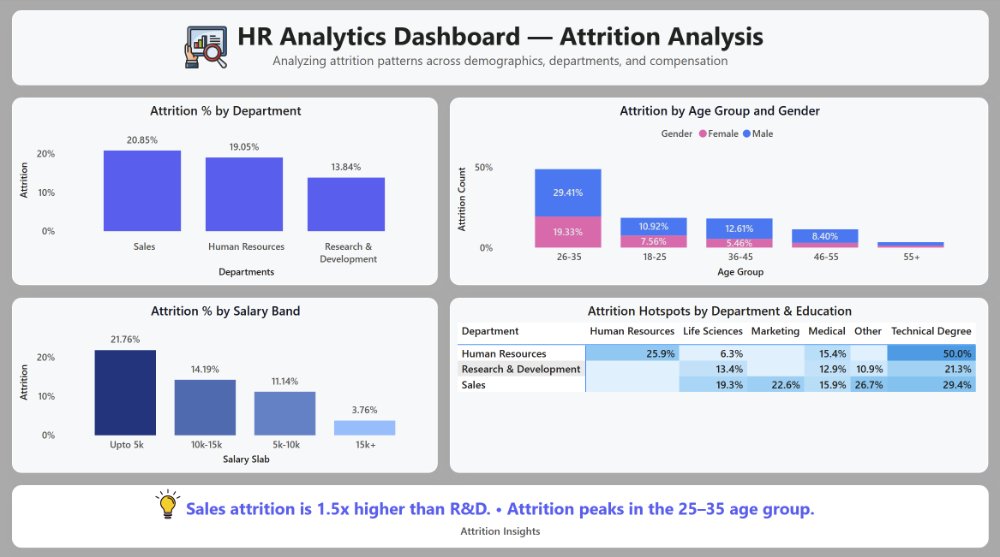
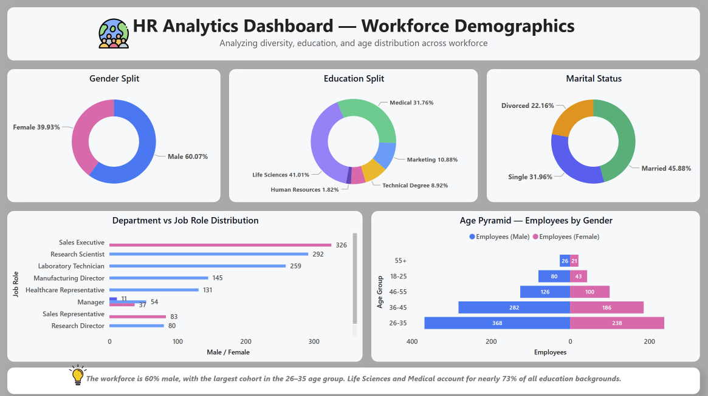

# Dashboard – Power BI

## Project Overview  
This project is an **interactive HR Analytics Dashboard** built in **Power BI** using a Kaggle HR dataset (~1.5k employee records).  
The dashboard enables HR leaders to **track workforce demographics, attrition patterns, and promotion trends**, helping organizations reduce turnover and improve employee satisfaction.

---

## Business Problem  
High employee attrition is one of the most critical challenges HR teams face. Without clear visibility into workforce patterns, companies risk:  
- Losing top performers  
- Increasing recruitment and training costs  
- Failing to identify **at-risk demographics and departments**  

**Goal:** Build an end-to-end HR analytics solution that identifies **who is leaving, why, and where to take action**.

---

## Data & Modeling  
- **Source:** Kaggle HR Analytics Dataset  
- **Size:** ~1,470 employee records  
- **Key Fields:** Age, Gender, Department, Job Role, Salary, Education, Performance Rating, Years at Company, Attrition  

### Data Cleaning & Modeling Steps  
✔ Converted categorical fields (Attrition, Gender, Marital Status) into measures for calculations  
✔ Created KPIs: Attrition %, Promotion Rate %, Avg Salary, Avg Tenure  
✔ Built AgeGroups, SalarySlabs, and Education categories for segmentation  
✔ Designed a clean **star-schema model** for performance  

---

## Dashboard Pages  

### **1️⃣ HR Overview**
**Purpose:** Provide a **bird’s eye view** of the workforce and attrition trends.  

**Visuals:**  
- KPI Cards: Employees, Attrition %, Promotion Rate %, Avg Salary, Avg Tenure  
- Donuts: Gender Split, Education Split, Marital Status  
- Line Area Chart: Employees by Tenure  
- Heatmap: Attrition Hotspots (Dept × Age Group)  
- Narrative Card: Dynamic HR Insights  

📸 

👉 **Insight:** Workforce is **60% male**; attrition highest in **Sales**; education mostly **Life Sciences & Medical (~73%)**.  

---

### **2️ Attrition Analysis**
**Purpose:** Deep-dive into **who is leaving and why**.  

**Visuals:**  
- Bar: Attrition % by Department  
- Stacked Bar: Attrition by Age Group + Gender  
- Bar: Attrition by Salary Band  
- Heatmap: Attrition by Department × Education  
- Narrative Card: Dynamic takeaway  

👉 **Insight:** Attrition in **Sales is 1.5× higher** than R&D.  
👉 Employees earning **<5k salary** are **5× more likely to leave**.  
👉 **26–35 age group** is the most vulnerable.  

---

### **3️ Workforce Demographics**
**Purpose:** Understand the **diversity and role distribution** across the company.  

**Visuals:**  
- Donuts: Gender, Education, Marital Status  
- Age Pyramid: Male vs Female by age groups  
- Bar: Department vs Job Role Distribution  
- Narrative Card: Cohort-level summary  

👉 **Insight:** Workforce skews young (**26–35 age group**) and male.  
👉 Job roles heavily concentrated in **Sales Executives and Research Scientists**.  
👉 Majority are **Married (46%)** employees.  

---

## 💡 Key Business Insights  
✔ Sales shows **highest attrition** — retention efforts should prioritize here  
✔ Younger employees (25–35) and **low salary bands** are most at risk  
✔ Majority of workforce has **Life Sciences & Medical education**  
✔ Highest churn occurs in the **first 3 years of tenure**  

---

## 📈 Impact Statement  
This dashboard enables HR teams to:  
- Identify **attrition hotspots** by department, role, and salary  
- Design **targeted retention strategies**  
- Improve **diversity tracking**  
- Reduce turnover costs  

---