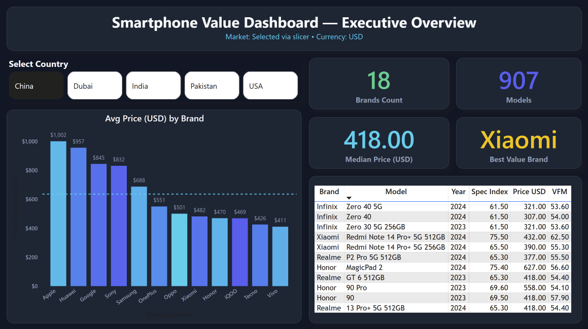
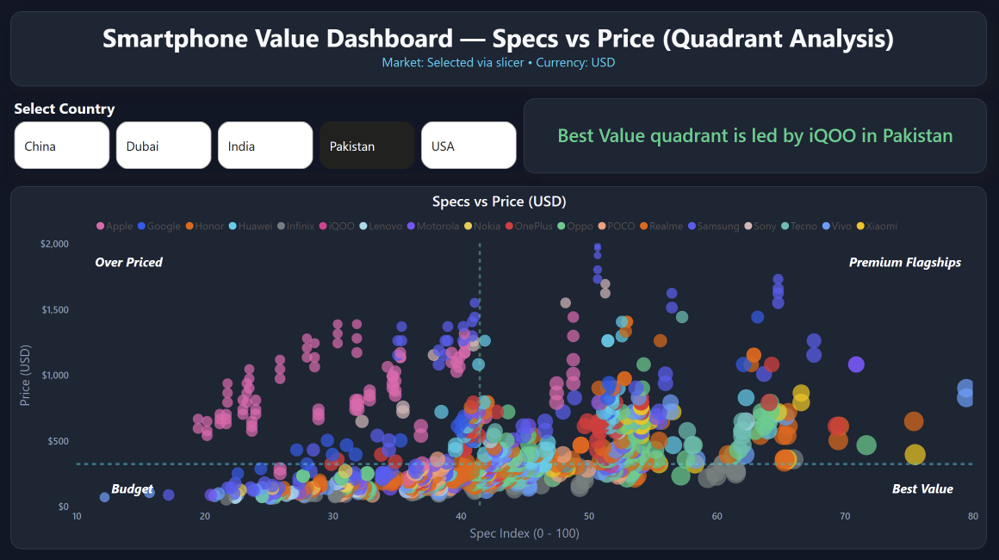

# 📊 Smartphone Value Dashboard (Power BI)

## 📝 Overview
This Power BI project analyzes **907 smartphone models** across **5 markets (Pakistan, India, China, USA, Dubai)** to uncover:  
- Which brands dominate **Premium vs Best Value** segments  
- How **specifications (RAM, Camera, Battery, Screen)** drive pricing  
- **Price gaps** across countries  
- The brands consistently delivering the **best value-for-money (VFM)**  

---

## 🎯 Business Problem
Smartphone markets are crowded with hundreds of models and highly dynamic pricing.  
- Consumers struggle to find **which devices give true value**.  
- Retailers and analysts lack a **consolidated global comparison**.  
- Companies want to know **which brands are overpriced vs underpriced** in different regions.  

👉 This dashboard solves the problem by combining **pricing + specifications** into a **Specs vs Price framework** that highlights **Best Value vs Premium vs Overpriced vs Budget** phones.

---

## 🛠️ Approach
### 1. Data Cleaning & Transformation (Power Query)
- Removed text units (e.g., `GB`, `mAh`, `MP`, `inches`) → converted to numeric  
- Standardized country prices → converted to USD baseline using exchange rates  
- Created normalized spec measures (RAM, Camera, Battery, Screen)  

### 2. Modeling & DAX
- **Spec Index (0–100)** = weighted score of RAM, Camera, Battery, Screen  
- **Price Index (0–100)** = relative normalized price across markets  
- **VFM Score** = Spec Index ÷ Price Index  
- **Median-based quadrant logic** → split scatter into **Best Value, Premium, Budget, Overpriced**  
- Dynamic measures to support slicers & auto-insights  

### 3. Dashboard Design
- Modern **dark theme** with indigo, cyan, and yellow highlights  
- Consistent layout → KPIs → insights → deep dive  
- Dynamic narrative cards → dashboard *tells a story*, not just shows data  

---

## 📸 Dashboard Pages

### **Page 1 — Executive Overview**

- KPIs: **Total Models, Brands Count, Median Price, Best Value Brand**  
- Country slicer: Pakistan, India, China, USA, Dubai  
- Bar Chart: Average Price by Brand  
- Table: Top 10 Best Value Phones (Spec Index, Price, VFM)  

**💡 Insight:**  
👉 *Xiaomi emerges as the **Best Value Brand**, with the global median smartphone price at **$418***  

---

### **Page 2 — Specs vs Price (Quadrant Analysis)**

- Scatter Plot: Specs vs Price, bubble size = VFM  
- Median lines → 4 quadrants:  
  - ✅ Best Value (High Specs, Low Price)  
  - 👑 Premium Flagships (High Specs, High Price)  
  - 🚨 Overpriced (Low Specs, High Price)  
  - 💸 Budget (Low Specs, Low Price)  
- Dynamic narrative: *“Best Value quadrant is led by iQOO in Pakistan.”*  

**💡 Insights:**  
- *iQOO and Realme dominate the Best Value quadrant in Asian markets*  
- *Apple & Samsung dominate Premium but often drift into Overpriced*  
- *Market medians: Price ≈ $418, Spec Index ≈ 42*  

---

## 🔑 Key Takeaways
- **Best Value = Xiaomi, iQOO, Realme** (depending on region)  
- **Premium = Apple, Samsung** (flagships dominate high price–high spec)  
- **Overpriced risk**: Some brands demand premium without matching specs  
- **Dynamic narrative cards** make the dashboard **self-explaining**  

---