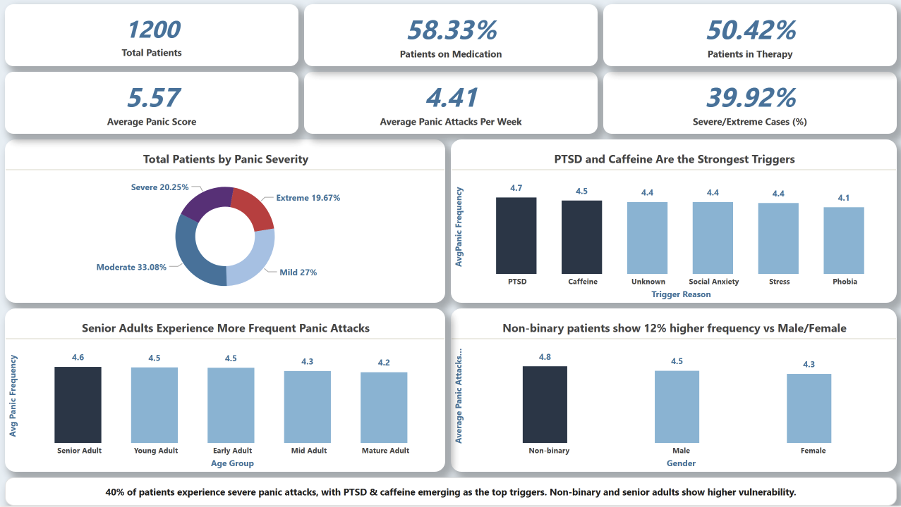

# 🧠 Panic Attack Patient Analytics Dashboard (Power BI)

## 📌 Project Overview  
This project delivers a **comprehensive data storytelling dashboard** on **panic attacks and mental health analytics**.  
Designed in **Power BI**, it transforms raw clinical data into **clear, interactive insights** for doctors, researchers, and decision-makers.  

The analysis connects **demographics, lifestyle, symptoms, triggers, and treatments** into one unified story, answering:  
- *Who is most at risk?*  
- *What factors drive panic attacks?*  
- *Do interventions (therapy, medication) actually work?*  

---

## 🎯 Business Problem  
Mental health data is often **fragmented** across spreadsheets and databases.  
Decision-makers struggle to:  
- Spot **patterns in severity across age/lifestyle groups**  
- Identify **top triggers and co-occurring symptoms**  
- Evaluate **effectiveness of therapy and medication**  

This dashboard consolidates everything into a **single BI solution**, making data **explorable, reliable, and decision-ready**.  

---

## Dashboard Pages & Insights  

### 🔹 **Page 1 – Executive Summary (Overview)**  
- KPIs: Total Patients, Avg Panic Score, % Severe, Avg Attack Frequency, % in Therapy, % on Medication  
- Severity Distribution
- Gender & Age Breakdown  
- Trend of Panic Attacks Over Time  

👉 *Quick, at-a-glance understanding of the overall situation.*  

---

### 🔹 **Page 2 – Demographics & Lifestyle Factors**  
- Avg Sleep Hours, % with Poor Sleep, % with No Exercise  
- Panic Severity by Age Group  
- Sleep Quality vs Severity  
- Exercise vs Panic Score  
- Caffeine & Alcohol Impact  

👉 *Uncovers lifestyle risks driving panic attacks.*  

---

### 🔹 **Page 3 – Symptoms & Triggers**  
- % Patients with Chest Pain, Dizziness, Trembling  
- Symptom Distribution & Co-occurrence  
- Top Triggers (Stress, Crowds, Exams, Bills, Caffeine, etc.)  
- Treemap: Trigger Contribution  

👉 *Explains “what patients feel” and “what sparks attacks.”*  

---

### 🔹 **Page 4 – Interventions & Outcomes**  
- Improvement % with vs without Therapy  
- Improvement % with vs without Medication  
- Combined Therapy + Medication Impact  
- Severity Comparison Charts  
- Lifestyle Risks × Therapy Effectiveness  

👉 *Validates treatment outcomes with data.*  

---

### 🔹 **Page 5 – Drill-Down Exploration**  
- Patient Table (Age, Gender, Panic Score, Therapy, Sleep Hours, Medication, etc.)  
- Filters & slicers (Age, Gender, Trigger, Severity)  
- Tooltip-enabled quick stats  

👉 *Lets clinicians & researchers drill into specific patients or cohorts.*  

---

## 🚀 Features  
✔️ Fully interactive and filterable views  
✔️ Advanced **DAX measures** for KPIs, percentages, and improvement tracking  
✔️ **Drill-through & tooltips** for deeper analysis  
✔️ **Row-level storytelling** – each page answers a unique question  
✔️ **Presentation-ready visuals** – professional design for portfolio & stakeholders  

---

## 🛠️ Tools & Skills Showcased  

### 🔹 **Power BI (Core Skills)**  
- Data Import & Transformation (Power Query)  
- Data Modeling (relationships, star schema design)  
- DAX Measures & Calculations  
  - % by Severity = DIVIDE(COUNTROWS(...), CALCULATE(COUNTROWS(...), ALL(...)))  
  - Average Panic Score, Trigger Frequency, Lifestyle Risks, Therapy Effectiveness  
- Time Intelligence (tracking panic attacks over time)  
- Drill-through, Filters, Tooltips  
- Visualizations: Donut, Treemap, Heatmap, Bar, Column, Clustered, Table  

### 🔹 **Data Engineering & Sources**  
- **Snowflake** → as cloud data warehouse for structured patient data  
- **SQL Queries** for extracting subsets before loading into Power BI  
- Experience with other sources: Excel, CSV, APIs  

### 🔹 **ETL & Data Preparation**  
- Cleaning messy patient data  
- Handling missing/null values (e.g., sleep hours, triggers)  
- Creating calculated columns for:  
  - Age Groups (18–25, 26–35, etc.)  
  - Severity Categories (Mild → Extreme)  
  - Trigger Groups (Stress, Social, Health, Lifestyle, Other)  

### 🔹 **Analytics & BI Storytelling**  
- KPI Design for executive summary  
- Cohort Analysis (age group × severity × lifestyle)  
- Symptom Co-occurrence patterns  
- Intervention Outcome Tracking  
- Data Storytelling layout → logical flow (Overview → Lifestyle → Symptoms → Outcomes → Drilldown)  

### 🔹 **Professional BI Practices**  
- Consistent **themes & color palettes**  
- **Slicer placement** for intuitive filtering  
- **Performance Optimization** – removing unused fields, reducing model size  
- Export-ready screenshots for stakeholders  

---

## 📸 Screenshots  

### Page 1 – Executive Summary  
  

### Page 2 – Demographics & Lifestyle  
  

*(More inside repository)*  

---

## 🌍 Business Value & Impact  
- 📈 Helps clinicians identify **high-risk patients** quickly  
- 🔍 Reveals **lifestyle risks** contributing to panic attacks  
- ⚕️ Shows **evidence of treatment effectiveness**  
- 🎯 Enables **data-driven decisions** in mental health research & therapy planning  
- 💼 Demonstrates **portfolio-ready BI & analytics skills**  

---

⚡ *This project demonstrates full-stack BI skills — from SQL & Snowflake extraction, Power Query data prep, DAX analytics, to professional Power BI storytelling. It’s portfolio-ready, industry-standard, and designed to impress recruiters, clients, and stakeholders.*  