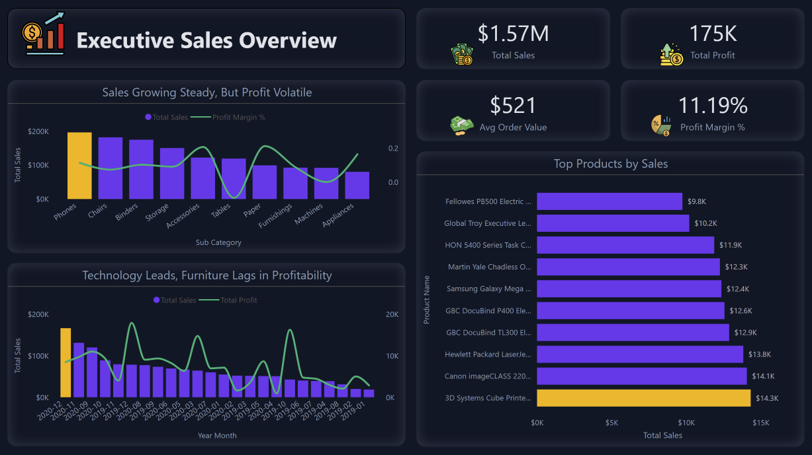
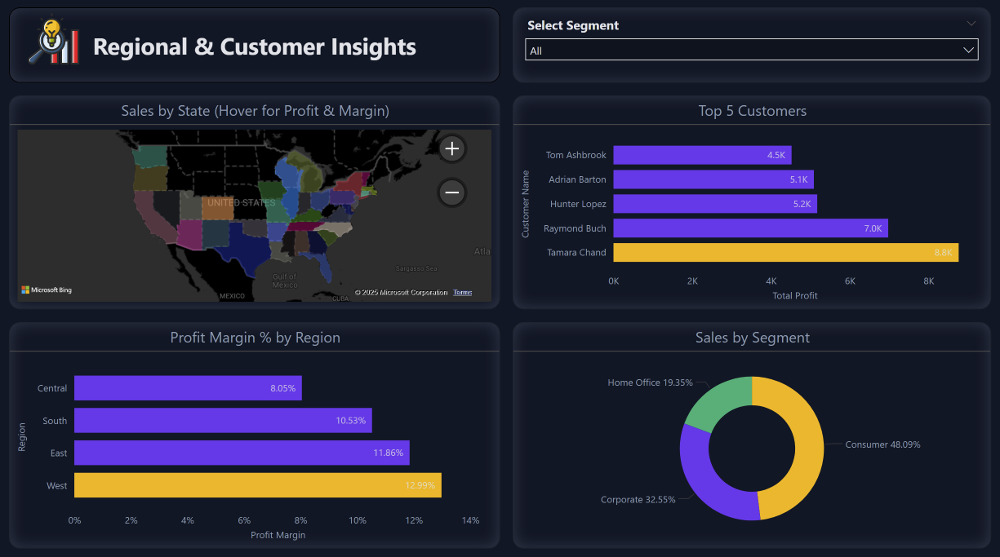
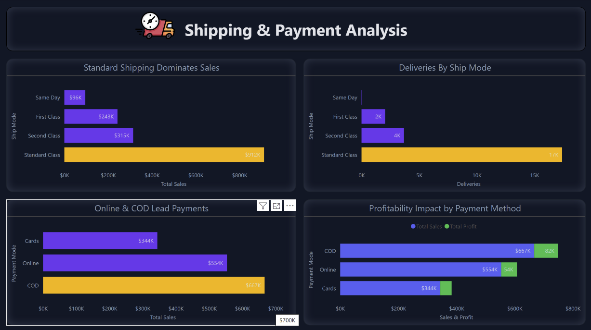

# Executive Sales Dashboard — Power BI

An **end-to-end Sales Analytics Dashboard** built in **Power BI**, designed to provide executives with a **360° view of sales performance, customer insights, and operational efficiency**.  
The dashboard highlights **growth trends, profit volatility, customer segmentation, shipping efficiency, and payment behaviors** — turning raw sales data into **actionable business decisions**.

---

## Project Overview
- **Tool Used:** Microsoft Power BI  
- **Dataset Size:** 10K+ orders across Products, Regions, Customers, and Shipping  
- **Focus Areas:** Sales, Profitability, Customers, Geography, Shipping & Payments  
- **Audience:** Business Executives, Regional Managers, Finance & Ops Teams  

The dashboard is structured into **three key pages** for clarity and storytelling.

---

## 🔹 Page 1 — Executive Sales Overview

### Key Features:
- **KPI Cards:** Total Sales, Total Profit, Avg Order Value, Profit Margin %  
- **Trend Analysis:** Sales vs Profit over time (monthly granularity)  
- **Category Insights:** Sales vs Profit by Sub-Category  
- **Product Spotlight:** Top 10 Products driving Sales  

 **Insights**:  
- Phones lead in overall sales, while Furniture lags in profitability.  
- Profit margin fluctuates sharply despite stable sales growth.  
- 3 products contribute disproportionately to revenue concentration.  

---

## 🔹 Page 2 — Regional & Customer Insights

### Key Features:
- **Geo Map:** Sales & Profit distribution by State  
- **Regional Profitability:** Profit Margin % by Region  
- **Customer Analysis:** Top 5 Customers ranked by Profit  
- **Segmentation Donut:** Consumer, Corporate, Home Office splits  

 **Insights**:  
- **West Region** dominates profitability (12.9%) while Central underperforms (8%).  
- Top customer (Tamara Chand) alone contributes ~$9K profit.  
- Consumers make up nearly **half of total sales (48%)**, confirming retail-driven revenue.  

---

## 🔹 Page 3 — Shipping & Payment Analysis

### Key Features:
- **Shipping Mode Analysis:** Standard Class dominates with ~$912K in Sales.  
- **Delivery Insights:** Majority of shipments are standard deliveries (~17K).  
- **Payment Trends:** COD (Cash on Delivery) is the leading payment mode (~$667K).  
- **Profitability Impact:** Comparison of Sales vs Profit across payment methods.  

 **Insights**:  
- Faster shipping (Same Day) drives lower sales volumes (~$96K).  
- COD payments deliver the highest sales and profit, while Card transactions lag.  
- Standard shipping remains cost-effective but affects delivery agility.  

---

## Business Impact
- Helps **Executives** track profitability and sales drivers.  
- Enables **Regional Managers** to identify underperforming regions.  
- Supports **Operations Teams** in optimizing shipping and payment modes.  
- Provides **Customer Teams** with insights into top customers and segments.  

---

## Tech Highlights
- **Power BI Features Used:**  
  - DAX Measures (Profit Margin %, Avg Order Value, Return Rate %)  
  - KPI Cards, Bar/Line Combo, Donuts, Maps, Custom Tooltips  
  - Page-level filters & interactive storytelling  
- **Design:**  
  - Dark modern UI with neon accents (#8B5CF6 purple, #FACC15 yellow, #22C55E green)  
  - Minimalist KPI layout with business-friendly icons  
  - Consistent storytelling titles for each visual  

---

## 🧑‍💻 Author
**Aijaz Ahmed**  
📍 Data Analyst | Power BI | Python | SQL  
📧 Contact: [ahmedaejaz147@gmail.com](mailto:ahmedaejaz147@gmail.com)  

---

✨ If you like this project, **star this repo ⭐