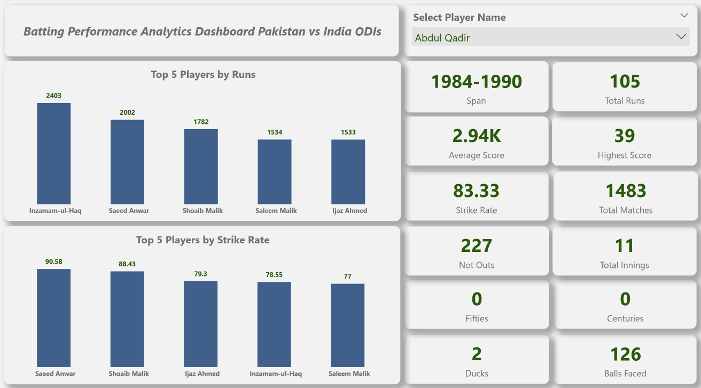
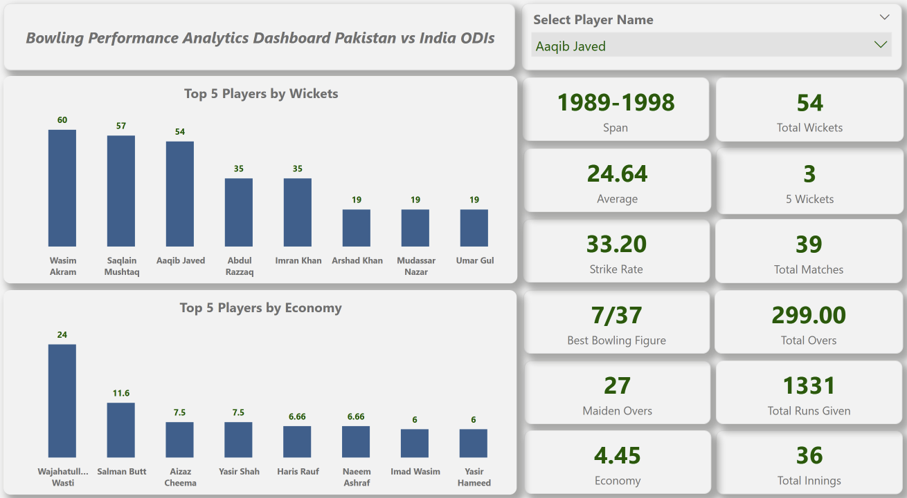

# 🏏 Pakistan vs India ODI Cricket Performance Analytics (Power BI)

## Project Overview
This project analyzes the **batting and bowling performance of Pakistani players against India in ODIs (1971–2025)**.  
It provides an **interactive Power BI dashboard** for selectors, analysts, and fans to explore long-term head-to-head player statistics.

The analysis covers **career-level batting and bowling summaries** for all Pakistani players, offering insights into:
- **Top performers** (by runs, average, strike rate, wickets, economy)
- **Consistency across eras**
- **Milestones** (centuries, fifties, 4-wicket & 5-wicket hauls)
- **Player-level interactive KPIs**

---

## Dashboard Preview

### 🔹 Batting Dashboard

### 🔹 Bowling Dashboard

---

## Tools & Technologies
- **Power BI Desktop** (Data Modeling, DAX Measures, Dashboard Design)  
- **Power Query** (Data Cleaning & Transformation)  
- **Web Scraping in Power BI** (StatsGuru / ESPN Cricinfo tables)  
- **Dataset:** Scraped & transformed directly from ESPN Cricinfo  

---

## Key Features
- Player-level KPIs: Runs, Average, Strike Rate, Centuries, Fifties, Ducks, Wickets, Economy, 4-fers, 5-fers.  
- Top 5 Leaderboards for **Runs, Strike Rate, Wickets, Bowling Average**.  
- Interactive slicer to filter by **Player Name**.  
- **Web scraping integrated into Power BI** to directly pull cricket statistics.  
- Clean, minimalistic UI with Pakistan’s **Green theme**.  